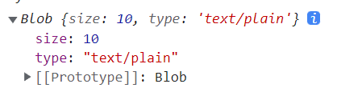
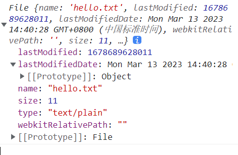

### 讲透前端文件切片上传、断点续传、拖拽上传、图片预览、文件下载（File、Blob、FormData、FileReader、URL.createObjectURL）  

---

要了解文件上传，首先需要了解blob对象。  
#### **Blob**  
全称是 binary large object,二进制大文件对象，非 Javascript 特有，计算机通用对象，不可修改。

**构造函数：Blob**

```js
new Blob(blobBits[, options])
```

blobBits：一个数组，成员可以是二进制对象或字符串，表示 Blob 的内容。
options：可选参数，可以设置以下两个属性：

- type：默认值为 ""，它代表了将会被放入到 blob 中的数组内容的 MIME 类型。
- endings：表示换行符的类型，可以是"transparent"、"native"或"lf"、"cr"、"crlf"。默认为"transparent"。

例子：

```js
const myBlob = new Blob(["了解Blob"], { type: "text/plain" });
```



使用场景：

1、分片上传  
File 对象是特殊类型的 Blob，且可以用在任意的 Blob 类型的上下文中。所以针对大文件传输的场景，我们可以使用 **slice** 方法对大文件进行切割，然后分片进行上传，具体示例如下：
```js
const file = new File(["a".repeat(1000000)], "test.txt");
const chunkSize = 40000;
const url = "https://httpbin.org/post";
async function chunkedUpload() {
  for (let start = 0; start < file.size; start += chunkSize) {
    const chunk = file.slice(start, start + chunkSize + 1);
    const fd = new FormData();
    fd.append("data", chunk);
    await fetch(url, { method: "post", body: fd }).then((res) =>
      res.text()
    );
  }
}
```

2、预览图片  
```js
/* 使用blob预览 */
const fileDom = document.getElementById("file");
const file = e.target.files[0];
const img = document.getElementById("img");
// File是Blob的子类，所以可以直接使用Blob的方法
// const blob = new Blob([file], { type: "image/png" });
img.src = URL.createObjectURL(blob);


/* 使用base64预览 */
const fileDom = document.getElementById("file");
const file = e.target.files[0];
const img = document.getElementById("img");
// FileReader将file转换为base64
const fileReader = new FileReader();
fileReader.readAsDataURL(file);
fileReader.onload = (e) => {
  img.src = e.target.result
};
```

3、下载文件  
```js
fetch('xxxx')
  .then(function (response) {
    // 使用fetch获取到的response对象的blob方法，将文件转换为blob对象
    return response.blob();
  })
  .then(function (myBlob) {
    /* 
    URL.createObjectURL(blob)生成的 URL 存储了一个 URL → Blob 映射。
    
    但实际上它也有副作用。虽然存储了 URL → Blob 的映射，但 Blob 本身仍驻留在内存中，浏览器无法释放它。映射在文档卸载时自动清除，因此 Blob 对象随后被释放。

    但是，如果应用程序寿命很长，那不会很快发生。因此，如果我们创建一个 Blob URL，即使不再需要该 Blob，它也会存在内存中。

    对这个问题，我们可以调用 URL.revokeObjectURL(url) 方法，从内部映射中删除引用，从而允许删除 Blob
     */

    let objectURL = URL.createObjectURL(myBlob);
    const link = document.createElement("a");
    // 设置下载链接
     link.href = objectURL;
    // 文件名称（类型）
    ink.download = 'test.png';
    ink.click();
    ink.remove();
    URL.revokeObjectURL(link.href);
  });
```


---


#### **File**  

```js
const file = document.getElementById("file");
// 获取文件
const file = input.current.files[0];

// file文件是File类型
console.log(file instanceof File); // true
```

File 对象代表一个文件，用来读写文件信息。它继承了 Blob 对象，或者说是一种特殊的 Blob 对象，所有可以使用 Blob 对象的场合都可以使用它。

**构造函数：File**

```js
new File(fileBits, fileName[, options])
```

fileBits：一个数组，成员可以是二进制对象或字符串，表示文件的内容。  
fileName：文件名。  
options：可选参数，可以设置以下两个属性：

- lastModified：文件最后修改时间，单位为毫秒，如果不传入该参数，会使用当前时间。
- type：文件类型，如果不传入该参数，会根据文件名自动判断。（MIME）

例子：

```js
var file = new File(["hello world"], "hello.txt", {
  type: "text/plain",
});
```



**适用于Blob的所有方法，File也可以使用**
- 切片上传
- 预览图片
- 下载文件


---


#### **FileReader**  
FileReader是一种异步读取文件机制。  

FileReader提供了如下方法：
- readAsDataURL(file)：读取文件内容，结果用data:url的字符串形式表示（base64）  
- readAsText(file, '编码方式')：按字符读取文件内容，结果用字符串形式表示
- abort()：终止文件读取操作

例子：

```js
var reader = new FileReader();
reader.readAsText(file);
reader.onload = function () {
     var txt = reader.result;
}
```

#### **FormData**  
FormData提供了一种表示表单数据的键值对 key/value 的构造方式，我们可以异步上传一个二进制文件（Blob）。

```js
const formData = new FormData();
formData.append("file", file);
...
```

- formData.append()：添向 FormData 中添加新的属性值，FormData 对应的属性值存在也不会覆盖原值，而是新增一个值，如果属性不存在则新增一项属性值。
- formData.get()：获取一个键值对
- formData.getAll()：获取所有键值对
- formData.has()：判断是否存在某个键值对
- formData.delete()：删除某个键值对
- formData.set()：设置某个键值对


---


上传文件主要分为两种方式：点击上传以及拖拽上传。

#### **点击上传**  

```js
// 单文件上传
const App = () => {
  const change = e => {
    const file = e.target.files[0];
    // 我们可以通过file.type来获取文件的类型，从而判断是否是图片或者限制上传的文件类型
    // const type = file.type;
    const formData = new FormData();
    formData.append('file', file);
    axios.post('http://localhost:1111/upload', formData).then(res => {
      console.log(res);
    }
    );
  };
  // accept属性用来限制上传的文件类型，可以是图片、视频、音频等
  return (
    <div className={styles.root}>
      <input type="file" onChange={change} /* accept=".jpeg,.png" */ />
    </div>
  );
};

// 多文件上传

/* 
  遍历上传
  我们可以给input标签添加multiple属性，这样就可以上传多个文件了。
  然后再通过e.target.files获取到所有的文件，然后遍历上传即可。
*/

/* 
  合并上传
  我们可以将所有的文件合并成一个FormData对象，然后一次性上传。
  但是这样会有一个问题，就是后端无法区分每个文件，所以我们需要在FormData对象中添加一个字段，用来区分每个文件。
  例如：formData.append('file', file, file.name);
  这样后端就可以通过file.name来区分每个文件了。
*/

/* 
  我们也可以不设置multiple属性，达到多文件上传的目的（一个一个的添加，缓存进数组里面再一次性上传）
*/
```

#### **图片预览**

```js
// 图片预览
const App = () => {
  const [base64, setBase64] = useState('');
  const change = e => {
    // file转base64预览

    // const file = e.target.files[0];
    // const fileReader = new FileReader();
    // fileReader.readAsDataURL(file);
    // fileReader.onload = e => {
    //   setBase64(e.target.result);
    // };

    // url -> blob映射预览
    const file = e.target.files[0];
    const url = URL.createObjectURL(file);
    setBase64(url);
  };
  return (
    <div className={styles.root}>
      <input type="file" onChange={change} />
      
    </div>
  );
};
```


#### **服务器文件下载**

```js
// 设置responseType为blob
// 接口数据返回的是一个blob类型的数据，我们可以通过URL.createObjectURL()方法将其转换成一个url，然后通过a标签的download属性来下载文件。
const App = () => {
  useEffect(() => {
    axios.get('http://localhost:1111/download',{
      responseType: 'blob'
    }).then(res => {
      const url = URL.createObjectURL(res.data);
      const a = document.createElement('a');
      a.href = url;
      a.download = 'test.png';
      a.click();
      URL.revokeObjectURL(url);
    });
  }, []);
  return (
    <div className={styles.root}></div>
  );
};
```


#### **切片上传**
```js
// 设置每个片段的大小chunkSize
// 使用blob的slice分片，大小根据chunkSize以及上传到的start决定。直到start > file.size
const App = () => {
  const change = e => {
    const file = e.target.files[0];
    const chunkSize = 4000;
    const url = "http://localhost:1111/upload";
    async function chunkedUpload() {
      for (let start = 0; start < file.size; start += chunkSize) {
        const chunk = file.slice(start, start + chunkSize + 1);
        const fd = new FormData();
        fd.append("file", chunk);
        await axios.post(url, fd);
      }
    }
    chunkedUpload();
  };
  return (
    <div className={styles.root}>
      <input type="file" onChange={change} />
    </div>
  );
};
```

#### **断点续传**

```js
// 通过current记录当前上传到的位置，通过pauseRef.current来判断是否暂停
// chunkCount = Math.ceil(fileSize / chunkSize) 计算出总共需要上传的片段数
const App = () => {
  const [file, setFile] = useState({});
  const [current, setCurrent] = useState(0);

  const pauseRef = useRef(false);
  const [pause, setPause] = useState(false);

  const change = e => {
    const _file = e.target.files[0];
    setFile(_file);
  };

  const upload = async file => {
    const chunkSize = 4000;
    const url = "http://localhost:1111/upload";
    const fileSize = file.size;
    const chunkCount = Math.ceil(fileSize / chunkSize);
    for (let i = current; i < chunkCount; i+=1) {
      if (pauseRef.current) return;
      const start = i * chunkSize;
      const end = (i + 1) * chunkSize;
      const chunk = file.slice(start, end);
      const fd = new FormData();
      fd.append("file", chunk);
      await axios.post(url, fd);
      setCurrent(i + 1);
    }
  };

  const clickPause = () => {
    pauseRef.current = !pauseRef.current;
    setPause(pauseRef.current);
    if (!pauseRef.current) upload(file);
  };

  return (
    <div className={styles.root}>
      <input type="file" onChange={change} />
      <button onClick={() => upload(file)}>上传</button>
      <button onClick={clickPause}>
        {pause ? '继续' : '暂停'}
      </button>
    </div>
  );
};
```

#### **上传进度**
- 大文件切片上传，可以通过计算每个片段的大小，然后计算出总共需要上传的片段数，然后通过current / chunkCount来计算出进度。
```js
const App = () => {
  const [file, setFile] = useState({});
  const [current, setCurrent] = useState(0);
  const [progress, setProgress] = useState(0);

  const pauseRef = useRef(false);
  const [pause, setPause] = useState(false);

  const change = e => {
    const _file = e.target.files[0];
    setFile(_file);
  };

  const upload = async file => {
    const chunkSize = 4000;
    const url = "http://localhost:1111/upload";
    const fileSize = file.size;
    const chunkCount = Math.ceil(fileSize / chunkSize);
    for (let i = current; i < chunkCount; i+=1) {
      if (pauseRef.current) return;
      const start = i * chunkSize;
      const end = (i + 1) * chunkSize;
      const chunk = file.slice(start, end);
      const fd = new FormData();
      fd.append("file", chunk);
      await axios.post(url, fd);
      setCurrent(i + 1);
      setProgress(Math.floor((i + 1) / chunkCount * 100));
    }
  };

  const clickPause = () => {
    pauseRef.current = !pauseRef.current;
    setPause(pauseRef.current);
    if (!pauseRef.current) upload(file);
  };

  return (
    <div className={styles.root}>
      <input type="file" onChange={change} />
      <button onClick={() => upload(file)}>上传</button>
      <button onClick={clickPause}>
        {pause ? '继续' : '暂停'}
      </button>
      <div className={styles.progress}>
        {progress}%
      </div>
    </div>
  );
};
```

- 通过xhr的onprogress来计算进度
```js
const App = () => {
  const [file, setFile] = useState({});
  const [progress, setProgress] = useState(0);

  const change = e => {
    const _file = e.target.files[0];
    setFile(_file);
  };

  const upload = async file => {
    const url = "http://localhost:1111/upload";
    const fd = new FormData();
    fd.append("file", file);
    await axios.post(url, fd, {
      onUploadProgress: e => {
        const percent = Math.floor((e.loaded / e.total) * 100);
        setProgress(percent);
      }
    });
  };

  return (
    <div className={styles.root}>
      <input type="file" onChange={change} />
      <button onClick={() => upload(file)}>上传</button>
      <div className={styles.progress}>
        {progress}%
      </div>
    </div>
  );
};
```


#### **拖拽上传**

```js
const App = () => {
  const dragover = e => {
    // 阻止默认事件
    e.preventDefault();
    // 阻止冒泡
    e.stopPropagation();
  };

  const drop = e => {
    // 阻止默认事件
    e.preventDefault();
    // 阻止冒泡
    e.stopPropagation();
    // DataTransfer表示拖放操作中的数据
    const file = e.dataTransfer.files[0];
    const formData = new FormData();
    formData.append('file', file);
    axios.post('http://localhost:1111/upload', formData).then(res => {
      console.log(res);
    }
    );
  };

  return (
    <div className={styles.root} onDragOver={dragover} onDrop={drop} >
      请拖到此处上传
      <input type="file" />
    </div>
  );
};
```